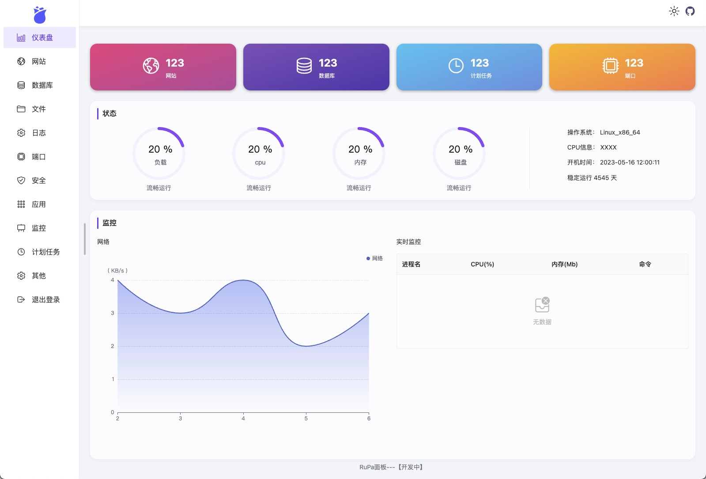

## 
 RuPa 

基于Rust+VUE3的Linux控制面板

### 痛点

- 以 Python 动态语言为主的宝塔面板，如今非常臃肿，因政策限制、广告等让人痛心疾首。
- 以 Go 为主的 1panel 几乎重构了宝塔面板，但严重依赖 docker，虽优秀但不够彻底。

### 新方案

- 基于 Rust 语言开发，仅保留高频使用功能。
- 零依赖、更小、更快、更安全。

### 开发路线图

- [✅]概念设计
- [✅]后端开发
- [✅]前端开发
- [✅]交互合并
- [WIP]功能完善
- []发布

### 如何参与

- 请先阅读 [开发者指南](/docs/贡献指南.md)

### 赞助商

- [腾讯云](https://curl.qcloud.com/nNN41sxS)
- [小白兔 AI](https://xiaobaituai.com)
